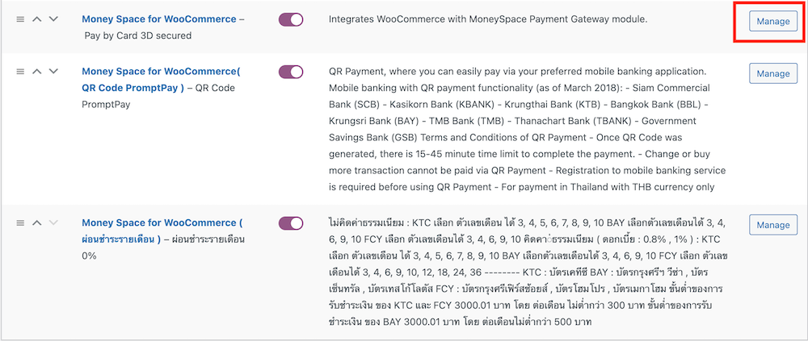
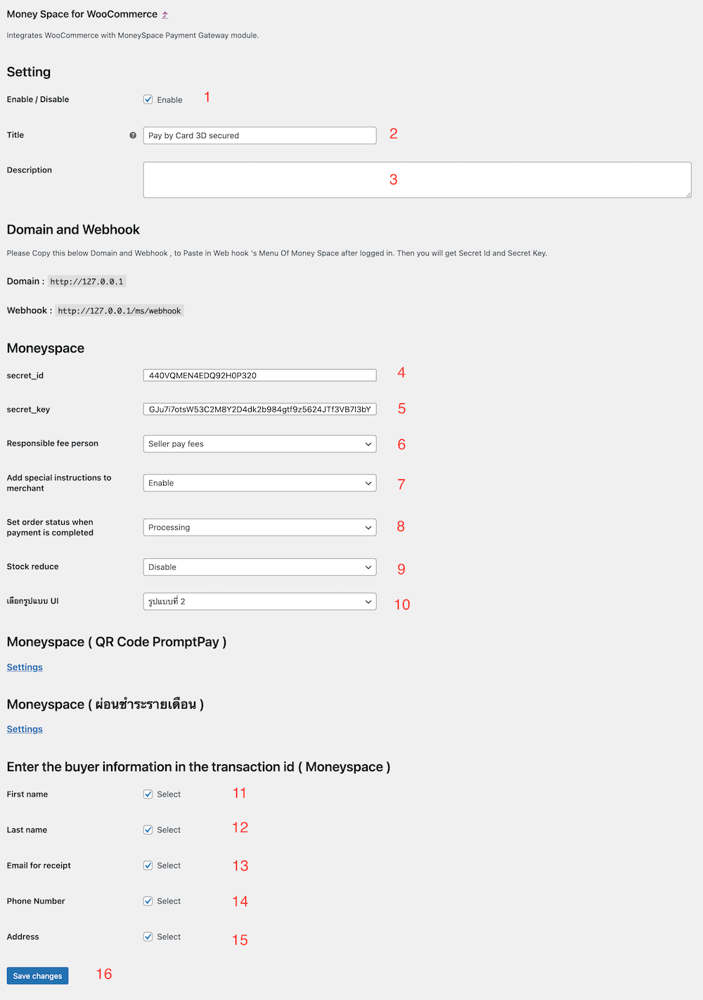
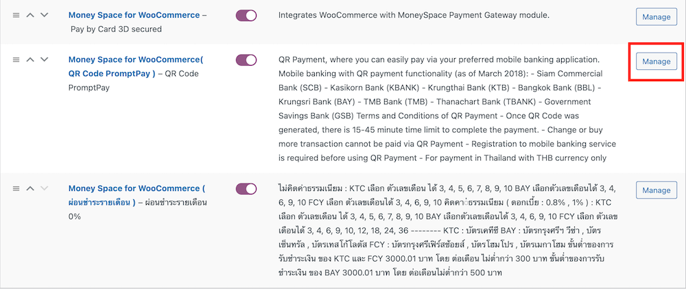
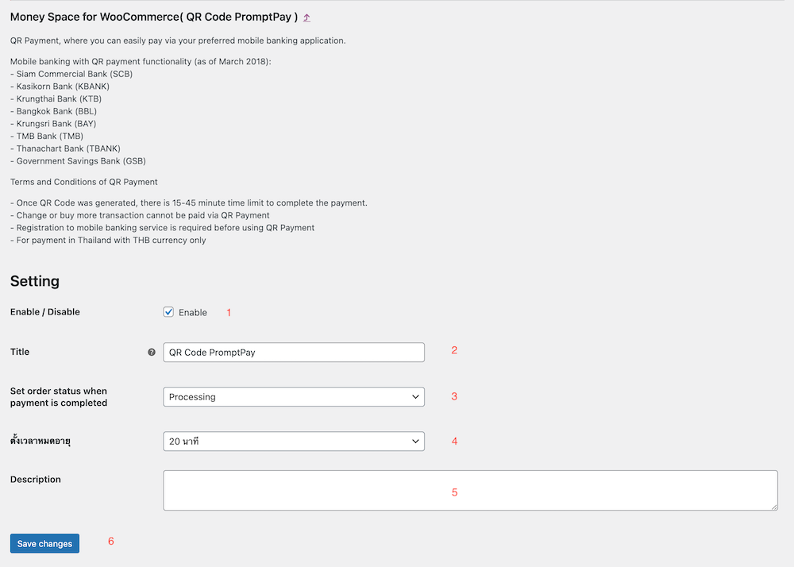
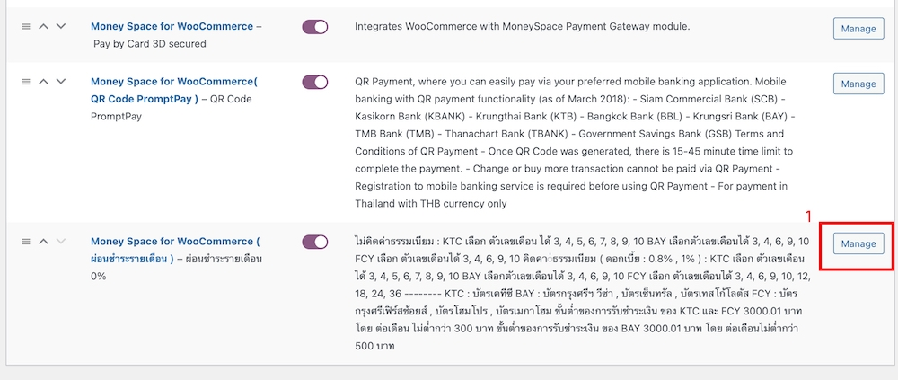
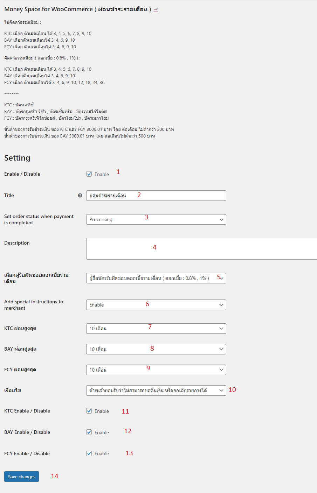
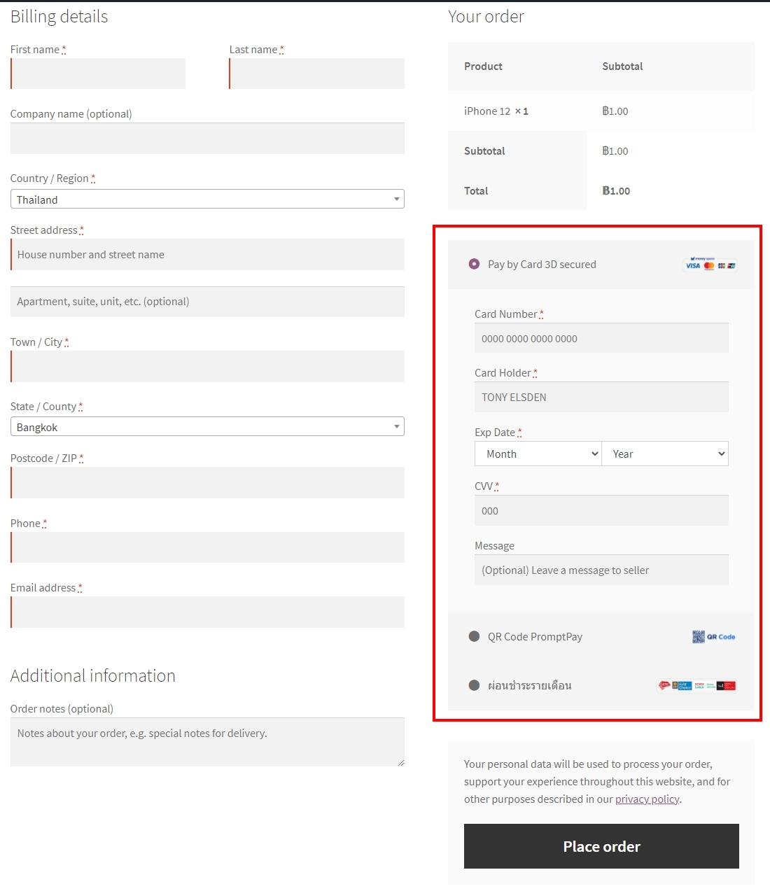
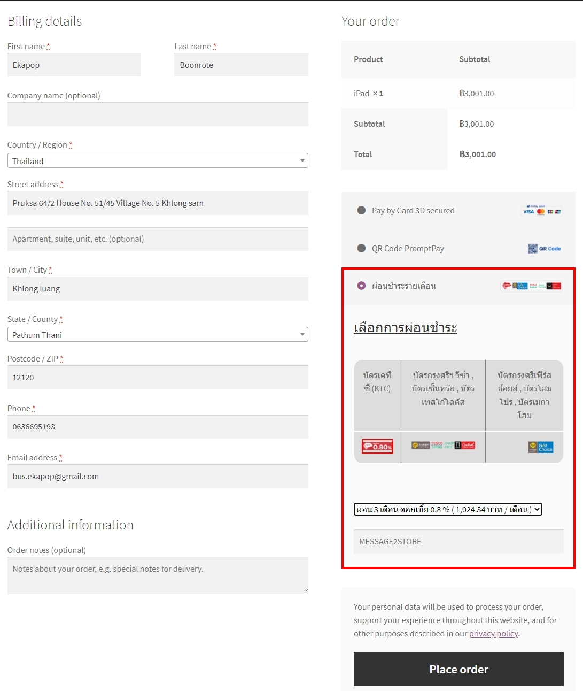

  

# วิธีติดตั้งและตั้งค่า Plugin

  

  

  

- ดาวน์โหลด Plugin

  

  

- แตกไฟล์ zip

  

  

- นำโฟลเดอร์ " Money Space For Woocommerce " ไปวางที่โฟลเดอร์ wp-content --> plugins

  
  

- กด Activate เพื่อใช้งาน

  
  

- ตั้งค่า plugin

  

- กด Setting หรือไปที่เมนู WooCommerce --> Settings --> Payments

  

## การตั้งค่า Pay by Card 3D secured

- 1 เปิดการใช้งาน(enable)

- 2 อัพเดทหัวข้อ

- 3 ใส่รายละเอียด

- 4 ใส่ secret_id ที่ได้จาก web hook

- 5 ใส่ secret_key ที่ได้จาก web hook

- 6 เลือกผู้รับผิดชอบค่าธรรมเนียม

- 7 เพิ่มคำแนะนำพิเศษให้กับผู้ขาย

- 8 ตั้งค่าสถานะของรายการสินค้าหลังจากจ่ายเงินสำเร็จ

- 9 ตั้งค่า Stock reduce

- 10 เลือกรูปแบบ UI

- 11 เพิ่มข้อมูลผู้ซื้อในรหัสธุรกรรม: ชื่อ

- 12 เพิ่มข้อมูลผู้ซื้อในรหัสธุรกรรม: นามสกุล

- 13 เพิ่มข้อมูลผู้ซื้อในรหัสธุรกรรม: อีเมล์

- 14 เพิ่มข้อมูลผู้ซื้อในรหัสธุรกรรม: เบอร์มือถือ

- 15 เพิ่มข้อมูลผู้ซื้อในรหัสธุรกรรม: ที่อยู่

- 16 บันทึกการตั้งค่า(Save Changes)

****

## การตั้งค่า การชำระแบบ QR Code

- 1 เปิดการใช้งาน(enable)

- 2 อัพเดทหัวข้อ

- 3 ตั้งค่าสถานะของรายการสินค้าหลังจากจ่ายเงินสำเร็จ

- 4 ตั้งเวลาหมดอายุ

- 5 ใส่รายละเอียด

- 6 บันทึกการตั้งค่า(Save Changes)

****

## การตั้งค่า ผ่อนชำระแบบรายเดือน

- 1 เปิดการใช้งาน(enable)

- 2 อัพเดทหัวข้อ

- 3 ตั้งค่าสถานะของรายการสินค้าหลังจากจ่ายเงินสำเร็จ

- 4 ใส่รายละเอียด

- 5 เลือกผู้รับผิดชอบดอกเบี้ยรายเดือน

- 6 เพิ่มคำแนะนำพิเศษให้กับผู้ขาย

- 7 เลือกจำนวนเดือน KTC ผ่อนสูงสุด

- 8 เลือกจำนวนเดือน BAY ผ่อนสูงสุด

- 9 เลือกจำนวนเดือน FCY ผ่อนสูงสุด

- 10 เลือกเงื่อนไขของการยกเลิกสินค้า

- 11 เปิดการใช้งานบัตร KTC

- 12 เปิดการใช้งานบัตร BAY

- 13 เปิดการใช้งานบัตร FCY

- 14 บันทึกการตั้งค่า(Save Changes)

****

# สร้าง Secret ID , Secret Key

  

  

  

- เข้าสู่ระบบ [https://www.moneyspace.net](https://www.moneyspace.net/)

  

  

- เมนู Webhooks

  

  

- กรอกโดเมน และ Webhook

  

  

  

  

  

  

****

  

  

  

# การชำระเงินด้วยบัตรเครดิต/เดบิต

  
  

  
  

  
  

****

  

  

# ชำระเงินด้วยคิวอาร์โค๊ด พร้อมเพย์

  
  

  
  

  
  

- เมื่อสแกนชำระเงินผ่าน Mobile Banking เรียบร้อยแล้ว **กรุณารอสักครู่** ระบบจะ Redirect ไปยังหน้าออเดอร์

- ถ้าสแกนชำระเงินผ่าน Mobile Banking ระบบแจ้งว่า QR Code หมดอายุหรือมีปัญหาในการชำระเงินกรุณา **รีเฟรชหน้าเว็บ หรือ กดชำระเงินอีกครั้ง**

  

****

  

# ผ่อนชำระรายเดือน

  

  
  

  
------------

# Plugin Installation and Configuration Manual

- Download a Woo / Wordpress plugin

  

  

- Extract a zipped file

  

  

- Copy folder `"Money Space For Woocommerce"` to /wp-content/plugins

  
  

- Click `"Activate"` to use the plugin

  
  

- Configure the plugin

  

- Click `"Setting"` or navigate to menu WooCommerce --> Settings --> Payments
  

****

## Configure Pay by Card 3D secured

- 1. Enable the service by ticking “Check Mark” at Enable box

- 2. Update a title

- 3. Fill in details

- 4. Specify ‘secret_id’ from web hook [Please find how to get this on Web hook section]

- 5. Specify ‘secret_key’ from web hook [Please find how to get this on Web hook section]

- 6. Specify a party responsible for the transaction fee

- 7. Add a special instruction for a seller

- 8. Set the status of the line item after successful payment

- 9. Configure Stock reduce

- 10. Select a UI design

- 11. Add buyer information to a transaction ID: First name

- 12. Add buyer information to a transaction ID: Last name 

- 13. Add buyer information to a transaction ID: Email address

- 14. Add buyer information to a transaction ID: Mobile phone number

- 15. Add buyer information to a transaction ID: Address 

- 16. Save changes

****

## Configure Payments via QR Code

- 1. Enable the service by ticking “Check Mark” at Enable box

- 2. Update a title

- 3. Set the status of the line item after successful payment

- 4. Set the expiration time

- 5. Fill in details

- 6. Save changes

****

## Configure Monthly Installments

- 1. Enable the service by ticking “Check Mark” at Enable box

- 2. Update a title

- 3. Set the status of the line item after successful payment

- 4. Fill in details

- 5. Specify a party responsible for the monthly installment interest

- 6. Add a special instruction for a seller

- 7. Select a number of maximum installment months (periods) for KTC

- 8. Select a number of maximum installment months (periods)  for BAY

- 9. Select a number of maximum installment months (periods)  for FCY

- 10. Choose terms of cancellation of the item purchased

- 11. Enable KTC Credit Card

- 12. Enable BAY Credit Card

- 13. Enable FCY Credit Card

- 14. Save changes

****

# Create Secret ID, Secret Key

- Login [https://www.moneyspace.net](https://www.moneyspace.net/)

- Go to menu `"Webhooks"`

- Specify a domain and Webhook

  

****

# Payment with Credit Card/ Debit Card

****

# Payment with PromptPay QR Code

- After scanning a QR code to make a successful payment via Mobile Banking, please wait for a moment for the system to redirect to an order page.

- If a payer (you) scan a QR Code to make a payment via Mobile Banking and the system notifies that the QR Code is expired or it has a problem about payment, please refresh a web page or make a payment again

****

# Pay with credit card installments

****

# Changelog

- 2022-02-20 : fix bug wordpress 5.9 not auto enqueue style

- 2022-01-13 : fix bug action hook not triggered

- 2021-12-19 : fix bug create card payment with buyer pay fee and add description of status after pay 

- 2021-11-21 : fix bug payment form not compatible themes

- 2021-10-17 : fix bug render html text

- 2021-10-09 : fix bug installment channel

- 2021-08-09 : fix bug remove some data on post meta

- 2021-08-04 : fix bug some Wordpress version can't working

- 2021-07-02 : fix bug credit card and installment with option buyer pay fees

- 2021-06-28 : verify credit card payment form

- 2021-06-23 : add shortcut credit card on place order page

- 2021-05-25 : update manual with english version

- 2021-05-18 : update manual

- 2021-05-12 : Fixed QR auto kill transaction id on server and add Time countdown on qr pay page.

- 2021-03-11 : Fixed bugs the order status update system.

- 2021-03-09 : Added the buyer system, responsible for the fee in the installment payment system.

- 2021-02-23 : Fixed payment bugs and product details.

- 2021-02-10 : Fixed stock reduction bugs and updated QR code expiration time settings.

- 2021-01-18 : Added a setting to be able to select the expiration time of the QR Code.

- 2021-01-15 : Added buyer fee system and plugin update system.

- 2020-12-28 : Updated security system UI type 1.

- 2020-12-19 : Updated settings to set order status when payment is complete ( QR Code and installment )

- 2020-11-18 : Updated redirect to the order received page upon successful payment.

- 2020-11-15 : Updated redirect to the order detail page upon successful payment and bugs fix.

- 2020-09-07 : Updated setting (Enter the buyer information in the transaction id)

- 2020-07-06 : Updated payment methods to light box and fixed bugs.

- 2020-04-09 : Updated QR promptpay (Redirect when payment completed)

- 2020-03-04 : Updated QR promptpay and added installment payments

- 2019-12-24 : Fixed bugs

- 2019-11-30 : Added stock setting

- 2019-09-13 : Added special instructions to merchant

- 2019-09-02 : Updated settings

- 2019-08-20 : Updated QR promptpay

- 2019-04-22 : Fixed payment errors

- 2019-02-11 : Added your domain and webhook

- 2019-01-26 : Added
