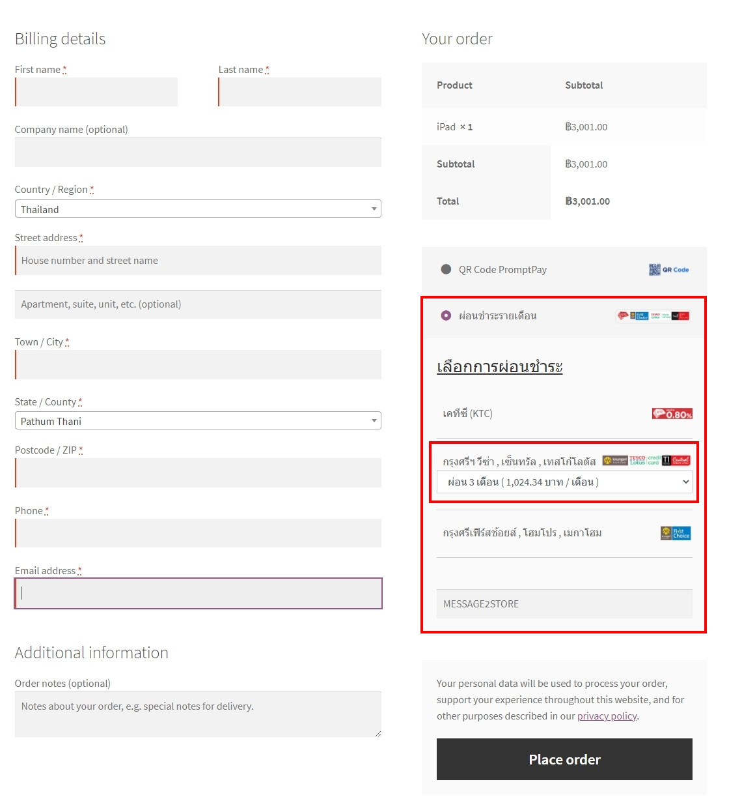

# 🚀 MoneySpace Payment Gateway for WooCommerce

A comprehensive WordPress/WooCommerce payment gateway plugin that enables secure online payments through **credit cards**, **QR codes (PromptPay)**, and **installment plans**. This plugin integrates with MoneySpace Payment Gateway to provide Thai businesses with a complete, PCI DSS-compliant payment solution.

A comprehensive WordPress/WooCommerce payment gateway plugin that enables secure online payments through **credit cards**, **QR codes (PromptPay)**, and **installment plans**. This plugin integrates with MoneySpace Payment Gateway to provide Thai businesses with a complete, PCI DSS-compliant payment solution.

## 🎯 Features

### 💳 Payment Methods
- **Credit Card Payments** - Secure 3D-secured processing for Visa, MasterCard, and local Thai cards
- **QR Code Payments** - PromptPay integration for instant mobile banking payments
- **Installment Plans** - Monthly installments with major Thai banks (KTC, BAY, FCY)

### 🏗️ Modern Architecture
- **WooCommerce Blocks** - Full support for Gutenberg block-based checkout
- **React Components** - Modern JavaScript with error boundaries and performance optimization
- **REST API Integration** - Robust API communication with comprehensive error handling
- **Mobile Responsive** - Optimized experience across all devices

### 🔒 Security & Compliance
- **PCI DSS Compliant** - Bank of Thailand approved payment method
- **3D Secure 2.0** - Enhanced fraud protection for card payments
- **SSL Required** - Encrypted communication for all payment data
- **Webhook Security** - Signed webhook validation for transaction updates

### 🌍 International Support
- **Multi-Currency** - Support for up to 27 foreign currencies
- **Alipay & WeChat Pay** - Chinese payment methods for international customers
- **Localization** - Thai and English language support

---

# วิธีติดตั้งและตั้งค่า Plugin

  

  

  

- ดาวน์โหลด Plugin

  

  

- แตกไฟล์ zip

  

  

- นำโฟลเดอร์ " Money Space For Woocommerce " ไปวางที่โฟลเดอร์ wp-content --> plugins

  
  

- กด Activate เพื่อใช้งาน

  
  

- ตั้งค่า plugin

  

- กด Setting หรือไปที่เมนู WooCommerce --> Settings --> Payments

  

## การตั้งค่า Pay by Card 3D secured

- 1 เปิดการใช้งาน(enable)

- 2 อัพเดทหัวข้อ

- 3 ใส่รายละเอียด

- 4 ใส่ secret_id ที่ได้จาก web hook

- 5 ใส่ secret_key ที่ได้จาก web hook

- 6 เลือกผู้รับผิดชอบค่าธรรมเนียม

- 7 เพิ่มคำแนะนำพิเศษให้กับผู้ขาย

- 8 ตั้งค่าสถานะของรายการสินค้าหลังจากจ่ายเงินสำเร็จ

- 9 ตั้งค่า Stock reduce

- 10 เลือกรูปแบบ UI

- 11 เพิ่มข้อมูลผู้ซื้อในรหัสธุรกรรม: ชื่อ

- 12 เพิ่มข้อมูลผู้ซื้อในรหัสธุรกรรม: นามสกุล

- 13 เพิ่มข้อมูลผู้ซื้อในรหัสธุรกรรม: อีเมล์

- 14 เพิ่มข้อมูลผู้ซื้อในรหัสธุรกรรม: เบอร์มือถือ

- 15 เพิ่มข้อมูลผู้ซื้อในรหัสธุรกรรม: ที่อยู่

- 16 บันทึกการตั้งค่า(Save Changes)

****

## การตั้งค่า การชำระแบบ QR Code

- 1 เปิดการใช้งาน(enable)

- 2 อัพเดทหัวข้อ

- 3 ตั้งค่าสถานะของรายการสินค้าหลังจากจ่ายเงินสำเร็จ

- 4 ตั้งเวลาหมดอายุ

- 5 ใส่รายละเอียด

- 6 บันทึกการตั้งค่า(Save Changes)

****

## การตั้งค่า ผ่อนชำระแบบรายเดือน

- 1 เปิดการใช้งาน(enable)

- 2 อัพเดทหัวข้อ

- 3 ตั้งค่าสถานะของรายการสินค้าหลังจากจ่ายเงินสำเร็จ

- 4 ใส่รายละเอียด

- 5 เลือกผู้รับผิดชอบดอกเบี้ยรายเดือน

- 6 เพิ่มคำแนะนำพิเศษให้กับผู้ขาย

- 7 เลือกจำนวนเดือน KTC ผ่อนสูงสุด

- 8 เลือกจำนวนเดือน BAY ผ่อนสูงสุด

- 9 เลือกจำนวนเดือน FCY ผ่อนสูงสุด

- 10 เลือกเงื่อนไขของการยกเลิกสินค้า

- 11 เปิดการใช้งานบัตร KTC

- 12 เปิดการใช้งานบัตร BAY

- 13 เปิดการใช้งานบัตร FCY

- 14 บันทึกการตั้งค่า(Save Changes)

****

# สร้าง Secret ID , Secret Key

  

  

  

- เข้าสู่ระบบ [https://www.moneyspace.net](https://www.moneyspace.net/)

  

  

- เมนู Webhooks

  

  

- กรอกโดเมน และ Webhook

  

  

  

  

  

  

****

  

  

  

# การชำระเงินด้วยบัตรเครดิต/เดบิต

  
  

  
  

  
  

****

  

  

# ชำระเงินด้วยคิวอาร์โค๊ด พร้อมเพย์

  
  

  
  

  
  

- เมื่อสแกนชำระเงินผ่าน Mobile Banking เรียบร้อยแล้ว **กรุณารอสักครู่** ระบบจะ Redirect ไปยังหน้าออเดอร์

- ถ้าสแกนชำระเงินผ่าน Mobile Banking ระบบแจ้งว่า QR Code หมดอายุหรือมีปัญหาในการชำระเงินกรุณา **รีเฟรชหน้าเว็บ หรือ กดชำระเงินอีกครั้ง**

  

****

  

# ผ่อนชำระรายเดือน

  

  
  

  
------------

# Plugin Installation and Configuration Manual

- Download a Woo / Wordpress plugin

  

  

- Extract a zipped file

  

  

- Copy folder `"Money Space For Woocommerce"` to /wp-content/plugins

  
  

- Click `"Activate"` to use the plugin

  
  

- Configure the plugin

  

- Click `"Setting"` or navigate to menu WooCommerce --> Settings --> Payments
  

****

## Configure Pay by Card 3D secured

- 1. Enable the service by ticking “Check Mark” at Enable box

- 2. Update a title

- 3. Fill in details

- 4. Specify ‘secret_id’ from web hook [Please find how to get this on Web hook section]

- 5. Specify ‘secret_key’ from web hook [Please find how to get this on Web hook section]

- 6. Specify a party responsible for the transaction fee

- 7. Add a special instruction for a seller

- 8. Set the status of the line item after successful payment

- 9. Configure Stock reduce

- 10. Select a UI design

- 11. Add buyer information to a transaction ID: First name

- 12. Add buyer information to a transaction ID: Last name 

- 13. Add buyer information to a transaction ID: Email address

- 14. Add buyer information to a transaction ID: Mobile phone number

- 15. Add buyer information to a transaction ID: Address 

- 16. Save changes

****

## Configure Payments via QR Code

- 1. Enable the service by ticking “Check Mark” at Enable box

- 2. Update a title

- 3. Set the status of the line item after successful payment

- 4. Set the expiration time

- 5. Fill in details

- 6. Save changes

****

## Configure Monthly Installments

- 1. Enable the service by ticking “Check Mark” at Enable box

- 2. Update a title

- 3. Set the status of the line item after successful payment

- 4. Fill in details

- 5. Specify a party responsible for the monthly installment interest

- 6. Add a special instruction for a seller

- 7. Select a number of maximum installment months (periods) for KTC

- 8. Select a number of maximum installment months (periods)  for BAY

- 9. Select a number of maximum installment months (periods)  for FCY

- 10. Choose terms of cancellation of the item purchased

- 11. Enable KTC Credit Card

- 12. Enable BAY Credit Card

- 13. Enable FCY Credit Card

- 14. Save changes

****

# Create Secret ID, Secret Key

- Login [https://www.moneyspace.net](https://www.moneyspace.net/)

- Go to menu `"Webhooks"`

- Specify a domain and Webhook

  

****

# Payment with Credit Card/ Debit Card

****

# Payment with PromptPay QR Code

- After scanning a QR code to make a successful payment via Mobile Banking, please wait for a moment for the system to redirect to an order page.

- If a payer (you) scan a QR Code to make a payment via Mobile Banking and the system notifies that the QR Code is expired or it has a problem about payment, please refresh a web page or make a payment again

****

# Pay with credit card installments

****

# Changelog

- 2026-01-09 : Version 3.0.0 - Critical bug fixes and standardization
- 2026-01-09 : Fix: Corrected non-existent WooCommerce hook `woocommerce_thankyou_custom` to proper `woocommerce_thankyou_{$payment_method_id}`
- 2026-01-09 : Fix: Standardized all database meta keys to use consistent UPPERCASE naming convention
- 2026-01-09 : Fix: Added missing script registration for QR code payment JavaScript (wp_register_script/wp_enqueue_script)
- 2026-01-09 : Fix: Corrected typo in check-payment endpoint ($_GET variable access)
- 2026-01-09 : Fix: JavaScript typo in QR payment checking function (refreshIdOfCheckPayment)
- 2026-01-09 : Improve: Thank you page now properly calls moneyspace_update_order_status() instead of returning empty string
- 2026-01-09 : Improve: Meta key consistency across all payment methods (credit card, QR, installment)

- 2025-12-23 : Security - Improve access control for payment callback/status endpoints
- 2025-12-23 : Security - Harden sensitive data handling (avoid logging secrets)

- 2025-12-23 : Update WooCommerce Blocks credit card UI to respect fee setting
- 2025-12-23 : Adjust checkout validation to allow redirect flow when fee setting is not "include"
- 2025-12-23 : Improve inline script enqueue for credit card template compatibility

- 2025-11-07 : Added configurable auto-check interval for QR Code payments
- 2025-11-07 : Improved QR payment user experience with customizable check intervals (5/10/15/30 seconds)
- 2025-11-07 : Fixed bitwise OR operator bug in QR payment status checking
- 2025-11-07 : Enhanced admin settings with auto-check result time option for QR payments
- 2025-11-07 : Improved internationalization for QR payment settings (Thai/English)

- 2025-10-11 : Enhanced WooCommerce Blocks compatibility and payment method icons
- 2025-10-11 : Improved installment form validation and notice clearing system
- 2025-10-11 : Fixed payment method label display and icon rendering issues
- 2025-10-11 : Enhanced React component error handling and debugging capabilities
- 2025-10-11 : Streamlined build process with improved webpack configuration
- 2025-10-11 : Updated documentation structure for better developer onboarding

- 2025-08-25 : clean: remove development and test files for production deployment  
- 2025-08-25 : clean: remove 11 development documentation files (DEBUG*.md, CONTRIBUTING.md, etc.)
- 2025-08-25 : clean: remove test utility files (test-*.php, debug-transaction.php, test-debug-utility.html)
- 2025-08-25 : optimize: plugin package size by removing non-essential development files
- 2025-08-25 : maintain: core functionality while reducing codebase complexity

- 2025-08-24 : fix: production compatibility by making debug file includes conditional
- 2025-08-24 : fix: prevent fatal errors when debug-config.php is missing in production package
- 2025-08-24 : fix: ensure blocks-debug-hook.php is only loaded when file exists and WP_DEBUG is enabled
- 2025-08-24 : improve: plugin stability in production environments without development files

- 2025-08-18 : fix: payment validation now blocks checkout on error (WooCommerce Blocks)
- 2025-08-18 : fix: prevent DOM removeChild errors by using CSS-only notice hiding
- 2025-08-18 : improve: payment method switching and validation state reset
- 2025-08-18 : enhance: error logging and debugging for payment forms
- 2025-08-18 : update: compatibility for WooCommerce 9.7.0+

- 2025-08-13 : Major WooCommerce compatibility update for v9.7.0+
- 2025-08-13 : Replace deprecated onCheckoutValidationBeforeProcessing with onCheckoutValidation
- 2025-08-13 : Replace deprecated onPaymentProcessing with onPaymentSetup
- 2025-08-13 : Enhanced error handling for WP_Error objects in HTTP requests
- 2025-08-13 : Improved React component stability with comprehensive error boundaries
- 2025-08-13 : Removed debug code for production deployment and optimized bundle size
- 2025-08-13 : Added comprehensive project documentation (CONTRIBUTING.md, INSTALLATION.md)
- 2025-08-13 : Updated all payment method components for current WooCommerce Blocks API
- 2025-08-13 : Enhanced payment processing reliability and eliminated console warnings
- 2025-08-13 : Implemented modern PHP 8.0+ practices and improved code quality

- 2025-04-28 : fix bug plugin not work on wordpress 6.8

- 2025-04-21 : fix bug cannot redeclare cancel_payment

- 2025-01-05 : fix bug update order status after pay

- 2024-12-21 : fix bug for woocommerce 9.5.1 and wordpress 6.7.1

- 2024-07-04 : add feature to download qrcode

- 2024-06-24 : fix bug router not found template and set default params

- 2024-05-27 : UI checkout page show progress when internet slow

- 2024-04-29 : tested up woocommerce 8.8.2 and wordpress 6.5.2

- 2024-04-21 : enhance cc template 2 to call payment link and fix bug installment option

- 2024-04-10 : fix bug filter cc template

- 2024-04-08 : fix bug router not found template, fix bug credit card not validate and remove force timezone when payment creation

- 2024-02-19 : release credit card installment for blocks-based feature and bug fixed credit card form not render exp month and year

- 2024-02-06 : enhance support woocommerce 8.x blocks-based feature

- 2024-01-11 : qr promptpay new option for auto check result

- 2023-10-12 : tested up with 6.3.1

- 2023-06-19 : add option to disable auto check qrnone

- 2023-04-23 : fix bug qrcode can't update payment status

- 2022-07-10 : custom payment status after payment is completed

- 2022-07-08 : fix bug callback not invalid parameter

- 2022-06-30 : fix bug checking qrnone status from api and set default enable stock reduce and force wc-completed after pay.

- 2022-06-28 : fix bug checking qrnone status from api

- 2022-05-30 : fix bug qrnone not rendering

- 2022-05-04 : fix bug qrnone not redirect after payment success and add option stock reduce in admin config

- 2022-04-18 : add log data for investigated and update payment api

- 2022-02-20 : fix bug wordpress 5.9 not auto enqueue style

- 2022-01-13 : fix bug action hook not triggered

- 2021-12-19 : fix bug create card payment with buyer pay fee and add description of status after pay

- 2021-11-21 : fix bug payment form not compatible themes

- 2021-10-17 : fix bug render html text

- 2021-10-09 : fix bug installment channel

- 2021-08-09 : fix bug remove some data on post meta

- 2021-08-04 : fix bug some Wordpress version can't working

- 2021-07-02 : fix bug credit card and installment with option buyer pay fees

- 2021-06-28 : verify credit card payment form

- 2021-06-23 : add shortcut credit card on place order page

- 2021-05-25 : update manual with english version

- 2021-05-18 : update manual

- 2021-05-12 : Fixed QR auto kill transaction id on server and add Time countdown on qr pay page.

- 2021-03-11 : Fixed bugs the order status update system.

- 2021-03-09 : Added the buyer system, responsible for the fee in the installment payment system.

- 2021-02-23 : Fixed payment bugs and product details.

- 2021-02-10 : Fixed stock reduction bugs and updated QR code expiration time settings.

- 2021-01-18 : Added a setting to be able to select the expiration time of the QR Code.

- 2021-01-15 : Added buyer fee system and plugin update system.

- 2020-12-28 : Updated security system UI type 1.

- 2020-12-19 : Updated settings to set order status when payment is complete ( QR Code and installment )

- 2020-11-18 : Updated redirect to the order received page upon successful payment.

- 2020-11-15 : Updated redirect to the order detail page upon successful payment and bugs fix.

- 2020-09-07 : Updated setting (Enter the buyer information in the transaction id)

- 2020-07-06 : Updated payment methods to light box and fixed bugs.

- 2020-04-09 : Updated QR promptpay (Redirect when payment completed)

- 2020-03-04 : Updated QR promptpay and added installment payments

- 2019-12-24 : Fixed bugs

- 2019-11-30 : Added stock setting

- 2019-09-13 : Added special instructions to merchant

- 2019-09-02 : Updated settings

- 2019-08-20 : Updated QR promptpay

- 2019-04-22 : Fixed payment errors

- 2019-02-11 : Added your domain and webhook

- 2019-01-26 : Added
